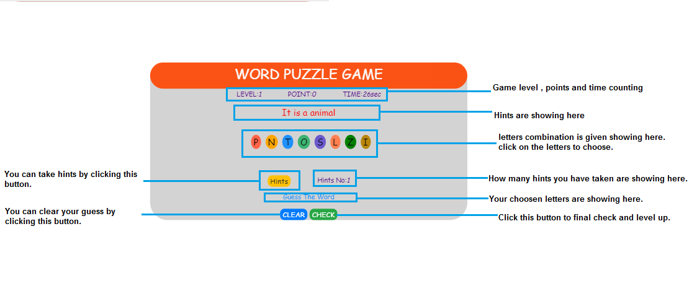

# WordPuzzleGame
Word puzzle Game to check your intelligence and knowledge
## Author:
Debarun Mitra
## Technology Used:
HTML, CSS, JavaScript, JQuery, Bootstrap
## Objective:
Create a word puzzle game
## Game Rules:
##### 1) You have given a set of letters.
##### 2) Click on given letter set, to guess the word.
##### 3) Your clicked letters are showing in the 'Guess the word' field.
##### 4) You can take hints by clicking the 'HINTS' button.
##### 5) You can take clear your guesses by clicking the 'Clear' button.
##### 6) Before checking your guess make sure that guess is your final guess.
##### 7) For correct guess you gain points and game level will up.
##### 8) For wrong guess game will be over, and you need to play from start.
## Image:

## Visit
[WordPuzzleGame](https://debarunmitra.github.io/WordPuzzleGame/)
